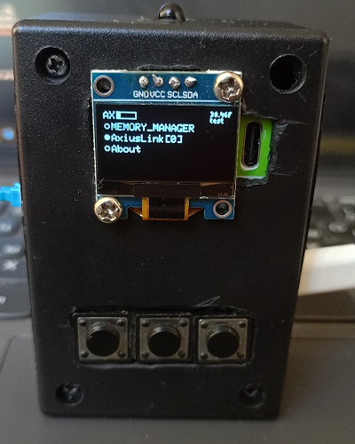

# Axius

This is core library for my arduino based devices and projects which are created on esp8266-like boards with SSD1306 displays

## Example of raw-launch of this library

```c++
#include <AxiusSSD.h>
AxiusSSD axius; //main instance (can be created only 1 time)

int upb = D8, dwnb = D0, okb = D7; //button defenitions

void setup() {
  randomSeed(148854271337);
  Serial.begin(115200);
  Wire.setClock(400000);

  axius.setLockScreen(renderInLockScreen); //what will be displayed in the "afk" screen
  axius.setLastPreparation(lastPreparation); //what will be executed after all "mods" prepared
  axius.setIconApplyer(applyIcons); //here you can put func which will be draw icons at the top of the screen
  axius.setLockScreenOverrideChecker(isLockScreenAnimationOverrided);
  axius.setIncomingPacketListener(onIncomingPacket); //listener for raw wifi packets

  axius.begin("AXIUS TEST", MemoryChip::c16, 10000.0f); //parameters: name of current device, type of memory chip (24c16 or 24c256) also can work without chip, time before device goes to afk mode in ms
}


void lastPreparation() {
  upb = D5, dwnb = D6; //here you last time to redefine input pins
}

void onIncomingPacket(esppl_frame_info *info) {
  
}

bool isLockScreenAnimationOverrided() {
  return false;
}

void renderInLockScreen() {
  
}

void loop() {
  updatebuttons(); //update the button states
  axius.tick();
  axius.endRender();
}

void applyIcons() {
  axius.additionalTextField = "test"; //text under fps meter
}

int voltage;
void updatebuttons() {
  voltage = digitalRead(okb);
  if (voltage == HIGH) {
    if (axius.oks == 0) axius.oks = 1;
  } else if (voltage == LOW) {
    if (axius.oks == 1) {
      axius.oks = 3;
      axius.lastActionTime = millis();
    }
  }
  
  if (!axius.FULLPREPARED) return;

  voltage = digitalRead(upb);
  if (voltage == HIGH) {
    if (axius.ups == 0) axius.ups = 1;
  } else if (voltage == LOW) {
    if (axius.ups == 1) {
      axius.ups = 3;
      axius.lastActionTime = millis();
    }
  }
  voltage = digitalRead(dwnb);
  if (voltage == HIGH) {
    if (axius.dwns == 0) axius.dwns = 1;
  } else if (voltage == LOW) {
    if (axius.dwns == 1) {
      axius.dwns = 3;
      axius.lastActionTime = millis();
    }
  }
}
```


## How it would look irl

On Axius NETMTT v1

